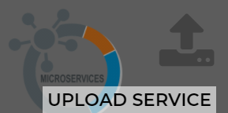

# Upload - Service (Microservice)

## Goal
Part of my Microservice architecture where I am creating standalone and reusable programmes. 
The Upload service is used to upload, validate and store files and to send back the location for further storage as a reference in an independent database. 

## MVP - features

 **Current**
 - upload files
 - store files
 - optional protecting the route with passport

**Upcoming**
 - connection with AWS S3 storage

  
## Tech-stack
 -  Node / Express
-   PassportJS
-   Multer
  

## Setup
After downloading or cloning the repo, you need to follow this steps to have the development environment running :

1.  Make sure that you have npm and node installed
2.  Install dependencies :  `npm install`
3.  In the project directory, run the command `npm run dev` to start the development server with nodemon

Using the server together with Authentification: 
4. Create config/config.env and add the following keys and values: NODE_ENV=development PORT=4000 MONGO_URI= JWT_SECRET=

